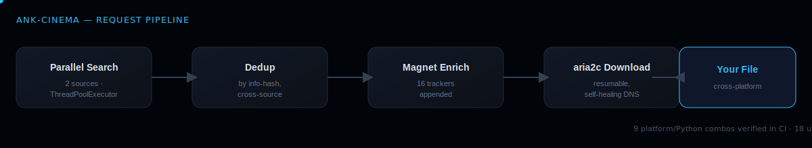
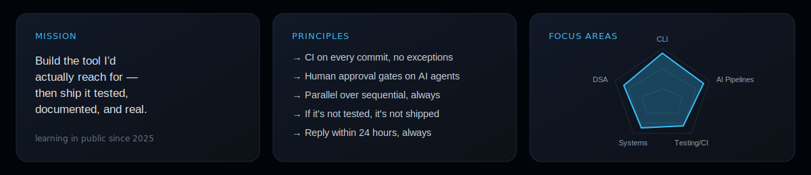

 

 

 

## Engineering Intelligence into SaaS & Infrastructure.

I am a Software Engineering undergrad at COMSATS University Lahore, specializing in MERN-stack development and AIOps. I don't just build UI clones; I focus on resilient infrastructure, CLI tools, and scalable applications. 

Currently, I help SaaS startups integrate AI into their products—taking raw ideas and turning them into working, AI-driven applications. My workflow is built on Linux, rigorous testing, CI/CD pipelines, and clean architecture.

 

## Technical Arsenal

 

## Experience & Leadership

* **AIOps & SaaS Engineer** (Freelance) · *Dec 2025 – Present*
  * Integrating AI agents and smart features into startup platforms, optimizing software functionality, and deploying production-ready AI pipelines.
* **Microsoft Learn Student Ambassador (MLSA)** · *CUI Lahore*
  * Contributing to technical communities, managing content editing, and collaborating with a global network of student developers.
* **Student Activities Coordinator** · *ACM Chapter, CUI Lahore*
  * Facilitated technical events, expanded professional networks, and collaborated with the 404 Squad and Event Emperors.

 

## Selected Work

 

<table>
<tr>
<td width="50%" valign="top">

### [ANK-CINEMA](https://github.com/Aizaz-Noor/ANK-CINEMA)

A cross-platform terminal media downloader engineered for speed and reliability. Built parallel multi-source search using `ThreadPoolExecutor`, deduplication by info-hash, and magnet enrichment across 16 trackers. Features self-healing DNS on Linux and a remote auto-updater that preserves system Python environments.

`Python` `Rich` `aria2c` `PyInstaller` `pytest`

**9** platform/Python combos verified in CI · **18** unit tests · **v3.0.1** released

</td>
<td width="50%" valign="top">

### [Agent-Startup-Skills](https://github.com/Aizaz-Noor/Agent-Startup-Skills)

An AI orchestrator that transforms Claude Code or Antigravity into a team of 8 specialist personas. They build SaaS products end-to-end, passing through a mandatory human approval gate between every single phase—including a strict OWASP security-audit step.

`Node.js` `LangGraph` `Claude Code` `YAML`

One-command `npx` install · Machine-readable `workflows.json` · MIT License

</td>
</tr>
</table>

 

## Engineering, measured

  

  
  &nbsp;
  

  

  

 

 

<picture>
  <source media="(prefers-color-scheme: dark)" srcset="https://raw.githubusercontent.com/Aizaz-Noor/Aizaz-Noor/output/snake-dark.svg" />
  <source media="(prefers-color-scheme: light)" srcset="https://raw.githubusercontent.com/Aizaz-Noor/Aizaz-Noor/output/snake.svg" />
  
</picture>

 

### Let's build something impactful.
Currently open to software engineering internships, open-source collaborations, and freelance AI integration projects.

[**View my Portfolio →**](https://github.com/Aizaz-Noor) &nbsp;&nbsp; [**Start a conversation →**](mailto:aizaznoorkhuwaja@gmail.com)

 

## Two years in. Shipping real tools.

My work started the way most do: building clones like Flappy Bird, Snake, and Minecraft. That pushed me into data structures and frontend systems like a blood bank portal and a habit tracker. But I didn't stay there. I moved from UI to infrastructure. I started writing CLI tools and AI agent pipelines with real test suites, real CI, and users who rely on them to work.

 

 

## Selected work

 

<table>
<tr>
<td width="50%" valign="top">

### [ANK-CINEMA](https://github.com/Aizaz-Noor/ANK-CINEMA)

A cross-platform terminal media downloader. I built parallel multi-source search using `ThreadPoolExecutor`, deduplication by info-hash, and magnet enrichment across 16 trackers. It includes self-healing DNS on Linux and a remote auto-updater that never touches system Python.

`Python` `Rich` `aria2c` `PyInstaller` `pytest`

**9** platform/Python combos verified in CI · **18** unit tests · **v3.0.1** released

</td>
<td width="50%" valign="top">

### [Agent-Startup-Skills](https://github.com/Aizaz-Noor/Agent-Startup-Skills)

An orchestrator that turns Claude Code or Antigravity into a team of 8 specialist personas. They build SaaS products end-to-end, passing through a mandatory human approval gate between every single phase—including a strict OWASP security-audit step.

`Node.js` `LangGraph` `Claude Code` `YAML`

One-command `npx` install · machine-readable `workflows.json` · MIT license

</td>
</tr>
</table>

 

## Engineering, measured

  

  
  &nbsp;
  

  

  

 

 

<picture>
  <source media="(prefers-color-scheme: dark)" srcset="https://raw.githubusercontent.com/Aizaz-Noor/Aizaz-Noor/output/snake-dark.svg" />
  <source media="(prefers-color-scheme: light)" srcset="https://raw.githubusercontent.com/Aizaz-Noor/Aizaz-Noor/output/snake.svg" />
  
</picture>

 

> Two shipped tools. No inflated claims. Everything above is verifiable by clicking through.

 
