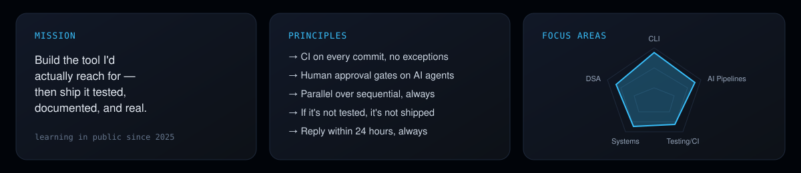
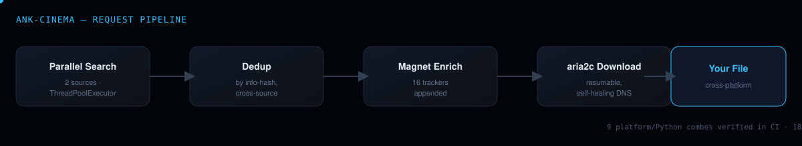

  

&nbsp;

&nbsp;

&nbsp;

 

## About Me

I am a Software Engineering student at **COMSATS University Islamabad (Lahore Campus)**. I build full-stack web applications with the MERN stack, 3D web interfaces with Three.js, and command-line tools in Python and C++.

- **What I work on:** Web apps (React 19, Node.js, Express, MongoDB), 3D browser graphics (Three.js / React Three Fiber), and desktop/CLI tooling (Python, C++).
- **Background:** Started with foundational projects like 2D games and university management systems, then moved into distributed search tools, custom physics implementations, and modern frontend design systems.
- **Location:** Lahore, Pakistan (UTC+5).

 

 

## Skills & Stack

<table>
  <tr>
    <td width="22%"><strong>Languages</strong></td>
    <td><code>Python</code> · <code>C++</code> · <code>Java</code> · <code>JavaScript (ES6+)</code> · <code>TypeScript</code> · <code>SQL</code> · <code>Bash</code></td>
  </tr>
  <tr>
    <td width="22%"><strong>Frontend &amp; 3D</strong></td>
    <td><code>React 19</code> · <code>Three.js</code> · <code>React Three Fiber</code> · <code>Tailwind CSS</code> · <code>HTML5</code> · <code>CSS3</code></td>
  </tr>
  <tr>
    <td width="22%"><strong>Backend &amp; DB</strong></td>
    <td><code>Node.js</code> · <code>Express.js</code> · <code>MongoDB</code> · <code>MySQL</code> · <code>REST APIs</code></td>
  </tr>
  <tr>
    <td width="22%"><strong>DevOps &amp; Tools</strong></td>
    <td><code>Git &amp; GitHub</code> · <code>Docker</code> · <code>Vite</code> · <code>Linux</code> · <code>Vercel</code> · <code>PyInstaller</code></td>
  </tr>
</table>

 

## Projects

<table>
  <tr>
    <td width="50%" valign="top">

### [3D Interactive Portfolio](https://github.com/Aizaz-Noor/MyCV) · [Live Demo ↗](https://aizaznoorkhuwaja.vercel.app/)
An interactive web portfolio built with React 19 and Three.js.
- Particle tunnel background rendered in WebGL with mouse parallax.
- Glassmorphism UI with custom spring animations and smooth transitions.
- Integrated PDF resume preview and zero-delay custom cursor.
- **Stack:** `React 19` `Three.js` `React Three Fiber` `Vite` `CSS3`

    </td>
    <td width="50%" valign="top">

### [ANK-CINEMA](https://github.com/Aizaz-Noor/ANK-CINEMA)
A cross-platform terminal media search and download tool.
- Parallel multi-source searching using `ThreadPoolExecutor` across 16 trackers.
- Magnet link enrichment, info-hash deduplication, and DNS failover on Linux.
- Packaged with PyInstaller so it runs without installing Python dependencies.
- **Stack:** `Python` `Rich` `aria2c` `PyInstaller` `pytest` · **v3.0.1**

    </td>
  </tr>
  <tr>
    <td width="50%" valign="top">

### [Newton's Glitch](https://github.com/Aizaz-Noor/Newtons-Glitch)
A physics-based arcade game written in Java and JavaFX without third-party game engines.
- Custom 2D physics loop handling gravity inversion and multi-object collisions at 60 FPS.
- State machines for player movement, hazards, and level transitions.
- **Stack:** `Java` `JavaFX` `OOP` `Game Dev`

    </td>
    <td width="50%" valign="top">

### [Weekly Habit Tracker](https://github.com/Aizaz-Noor/habit-tracker) · [Live Demo ↗](https://habit-tracker-beryl-chi.vercel.app)
A lightweight habit tracker with visual streak analysis.
- Multi-week streak calculation and instant state sync with LocalStorage.
- Clean responsive grid layout for daily check-ins and completion metrics.
- **Stack:** `React` `Vite` `Tailwind CSS`

    </td>
  </tr>
  <tr>
    <td colspan="2" valign="top">

### [Hostel Kharcha Manager](https://github.com/Aizaz-Noor/Hostel-Kharcha-Manager)
A terminal-based shared expense manager written in C++ for roommates and hostel students.
- Custom hash map data structures for fast lookups and debt calculations.
- Formatted text UI with automated monthly breakdown reports and file persistence.
- **Stack:** `C++` `CLI` `Data Structures` `File I/O`

    </td>
  </tr>
</table>

 

## Certifications

- **Microsoft Learn Student Ambassador** — Microsoft (2025)
- **Career & Soft Skills Program** — Google / PFA (2024)
- **Frontend Web Development** — MLSA FAST Peshawar (2024)
- **ACM Leadership & Event Management** — ACM CUI Lahore (2024)

 

## Activity & Stats

&nbsp;

&nbsp;

  

  
  &nbsp;
  

  

  

 

 

<picture>
  <source media="(prefers-color-scheme: dark)" srcset="https://raw.githubusercontent.com/Aizaz-Noor/Aizaz-Noor/output/snake-dark.svg" />
  <source media="(prefers-color-scheme: light)" srcset="https://raw.githubusercontent.com/Aizaz-Noor/Aizaz-Noor/output/snake.svg" />
  
</picture>

 

---

  <a href="https://aizaznoorkhuwaja.vercel.app/">aizaznoorkhuwaja.vercel.app</a>

