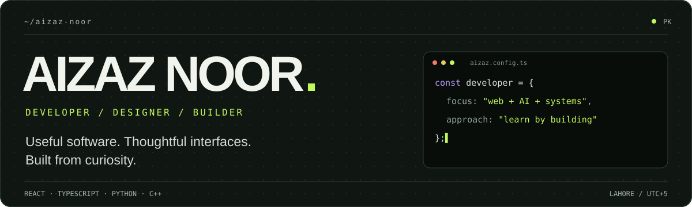
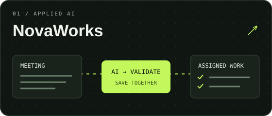
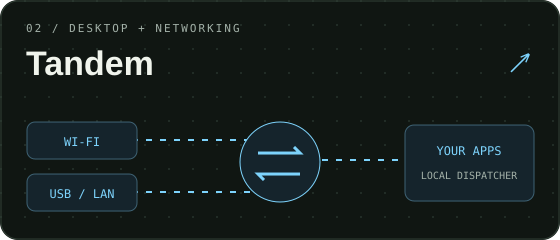
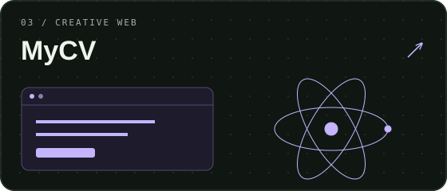
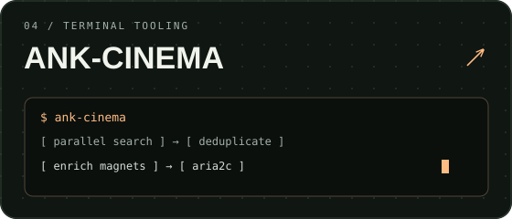
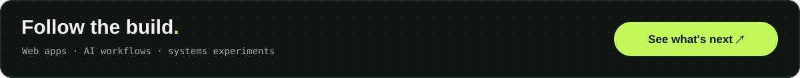

<a href="https://aizaznoorkhuwaja.vercel.app/"><picture><source media="(max-width: 600px)" srcset="./assets/developer-hero-mobile.svg" /></picture></a>

<b>I build web experiences, AI workflows, and practical tools.</b> Software Engineering student · COMSATS, Lahore · Pakistan

<a href="https://aizaznoorkhuwaja.vercel.app/"><b>Portfolio ↗</b></a> &nbsp; / &nbsp; <a href="https://www.linkedin.com/in/aizaz-noor">LinkedIn</a> &nbsp; / &nbsp; <a href="mailto:aizaznoorkhuwaja@gmail.com">Email</a>

### Selected builds

<table>
<tr>
<td width="50%" valign="top">

<b>NovaWorks</b> Meeting decisions → projects, owners, deadlines. Code Nomads · My role: UI/UX, frontend &amp; integration.

<code>React</code> <code>Express</code> <code>PostgreSQL</code>

<a href="https://github.com/Aizaz-Noor/Nova-Works">Code</a> · <a href="https://nova-works-zeta.vercel.app">Live demo ↗</a>

</td>
<td width="50%" valign="top">

<b>Tandem</b> A Windows interface for multiple internet links. Local mode distributes separate app connections.

<code>Tauri</code> <code>TypeScript</code> <code>Python</code>

<a href="https://github.com/Aizaz-Noor/Tandem">Code</a> · <a href="https://github.com/Aizaz-Noor/Tandem/releases/latest">Releases ↗</a>

</td>
</tr>
<tr>
<td width="50%" valign="top">

<b>MyCV</b> My work, presented with a little depth. Optional 3D atmosphere; readable without WebGL.

<code>React 19</code> <code>Three.js</code> <code>Vite</code>

<a href="https://github.com/Aizaz-Noor/MyCV">Code</a> · <a href="https://aizaznoorkhuwaja.vercel.app/">Live site ↗</a>

</td>
<td width="50%" valign="top">

<b>ANK-CINEMA</b> Parallel media search from the terminal. Deduplicated results and enriched magnet links.

<code>Python</code> <code>Rich</code> <code>aria2c</code>

<a href="https://github.com/Aizaz-Noor/ANK-CINEMA">Code</a> · <a href="https://github.com/Aizaz-Noor/ANK-CINEMA#how-it-works">Architecture ↗</a>

</td>
</tr>
</table>

<b>Also built:</b> <a href="https://github.com/Aizaz-Noor/habit-tracker">Habit Tracker</a> · <a href="https://github.com/Aizaz-Noor/Hostel-Kharcha-Manager">Hostel Kharcha Manager</a> · <a href="https://github.com/Aizaz-Noor/Newtons-Glitch">Newton's Glitch</a>

### Daily drivers

<code>React</code> <code>TypeScript</code> <code>Node.js</code> <code>Python</code> <code>C++</code> <code>SQL</code> <code>Git</code> <code>Vercel</code>

<a href="https://github.com/Aizaz-Noor?tab=overview"><picture><source media="(max-width: 600px)" srcset="./assets/follow-builds-mobile.svg" /></picture></a>

Watch my contributions take shape 🐍

 
<picture>
<source media="(prefers-color-scheme: dark)" srcset="https://raw.githubusercontent.com/Aizaz-Noor/Aizaz-Noor/output/snake-dark.svg" />
<source media="(prefers-color-scheme: light)" srcset="https://raw.githubusercontent.com/Aizaz-Noor/Aizaz-Noor/output/snake.svg" />

</picture>

