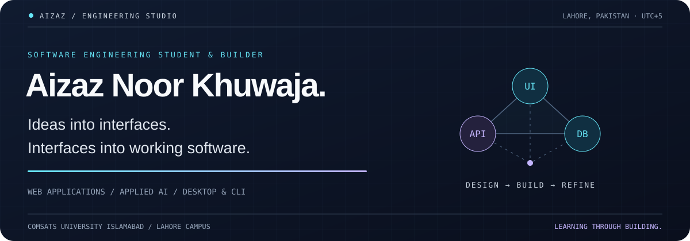

# Hi, I'm Aizaz 👋

**I turn everyday problems into software people can use.**

Software Engineering student at **COMSATS University Islamabad, Lahore Campus**. 
Working across web interfaces, AI integrations, and desktop tools — with an eye for design and a habit of learning by building.

[Featured work](#featured-work) · [Toolbox](#toolbox) · [Beyond the code](#beyond-the-code) · [Activity](#activity)

---

## What I'm building toward

My projects range from a weekly habit tracker to a Windows networking app and an AI meeting-to-task workflow. I enjoy the whole path: understanding a problem, designing the interface, connecting the logic, and making the result easier to use.

- **Web & interaction:** React applications, responsive interfaces, and optional Three.js experiences.
- **Applied AI:** Turning model output into validated, saved work with clear permissions and recovery states.
- **Systems & tools:** Python automation, C++ data structures, and desktop networking with Tauri.
- **Engineering habits:** Tests, readable documentation, and honest descriptions of what each project can do.

## Featured work

### 01 / NovaWorks — From meeting decisions to assigned work

**An AI project-management demo built with Code Nomads.** Meeting transcripts become saved projects and tasks with owners, deadlines, and effort estimates. The app validates the generated batch before saving it and scopes access by role.

My contribution: **product direction, UI/UX, frontend, integration, and repository ownership**.

`React 19` `Node.js` `Express 5` `PostgreSQL / SQLite` `AI integration`

[Explore the code →](https://github.com/Aizaz-Noor/Nova-Works) · [Try the demo ↗](https://nova-works-zeta.vercel.app) · [Walkthrough](https://github.com/Aizaz-Noor/Nova-Works/blob/main/docs/assets/novaworks-demo.mp4)

Peek inside the workspace

 

Built for the Infinity Hack '26 challenge and improved afterward as a portfolio project. The public demo uses shared fictional accounts.

### 02 / Tandem — A desktop interface for multiple internet links

**A Windows app for choosing and managing network adapters.** Local Dispatcher distributes separate proxy-aware connections across selected adapters; optional Cloud Bonding connects to a compatible server.

A project at the intersection of desktop UI, Python services, and network behavior. Local mode does not merge multiple links into one faster download.

`Tauri 2` `React` `TypeScript` `Python` `Networking`

[Explore the code →](https://github.com/Aizaz-Noor/Tandem) · [Windows releases ↗](https://github.com/Aizaz-Noor/Tandem/releases/latest)

### 03 / MyCV — A portfolio with room for a little atmosphere

**My personal home on the web.** A React portfolio with project stories, credentials, contact options, and a résumé viewer. An optional Three.js background adds depth on supported desktops; the main content works without WebGL.

`React 19` `Vite` `Three.js` `CSS`

[Explore the code →](https://github.com/Aizaz-Noor/MyCV) · [Visit the portfolio ↗](https://aizaznoorkhuwaja.vercel.app/)

### 04 / ANK-CINEMA — Parallel search, built for the terminal

**A Python media search and download CLI.** Two sources are searched concurrently, results are deduplicated by info-hash, and magnet links are enriched with trackers before being passed to aria2c.

`Python` `Rich` `ThreadPoolExecutor` `aria2c` `pytest`

[Explore the code →](https://github.com/Aizaz-Noor/ANK-CINEMA) · [How it works](https://github.com/Aizaz-Noor/ANK-CINEMA#how-it-works)

### More from the workshop

| Project | The idea | Built with |
| :--- | :--- | :--- |
| [Weekly Habit Tracker](https://github.com/Aizaz-Noor/habit-tracker) | A weekly check-in grid, streaks across weeks, and browser-local persistence. | React 19, TypeScript, Vite, plain CSS |
| [Hostel Kharcha Manager](https://github.com/Aizaz-Noor/Hostel-Kharcha-Manager) | Shared expense tracking for roommates and hostel students. | C++, data structures, file I/O |
| [Newton's Glitch](https://github.com/Aizaz-Noor/Newtons-Glitch) | A Flappy Bird reimagining with particles and adaptive difficulty. | Java, JavaFX, Maven |

## Toolbox

| Area | Technologies I work with |
| :--- | :--- |
| **Languages** | JavaScript · TypeScript · Python · C++ · Java · SQL |
| **Interfaces** | React · HTML · CSS · Tailwind CSS · Three.js · JavaFX |
| **Backend & data** | Node.js · Express · REST APIs · PostgreSQL · SQLite · MySQL |
| **Desktop & tooling** | Tauri · Git & GitHub · Vite · Vercel · Linux |
| **Testing** | pytest · Automated checks with GitHub Actions |

## Beyond the code

Based in **Lahore, Pakistan (UTC+5)**. My learning started with games, university projects, and data structures, and now includes building complete applications with interfaces, services, and deployment.

Community & credentials

- **Microsoft Learn Student Ambassador** — Microsoft, 2025
- **Career & Soft Skills Program** — Google / PFA, 2024
- **Frontend Web Development** — MLSA FAST Peshawar, 2024
- **ACM Leadership & Event Management** — ACM CUI Lahore, 2024

## Activity

Explore [my repositories](https://github.com/Aizaz-Noor?tab=repositories) and [recent GitHub activity](https://github.com/Aizaz-Noor?tab=overview) for the latest work.

<picture>
  <source media="(prefers-color-scheme: dark)" srcset="https://raw.githubusercontent.com/Aizaz-Noor/Aizaz-Noor/output/snake-dark.svg" />
  <source media="(prefers-color-scheme: light)" srcset="https://raw.githubusercontent.com/Aizaz-Noor/Aizaz-Noor/output/snake.svg" />
  
</picture>

---

**Have an interesting problem to build around?**

[Email me](mailto:aizaznoorkhuwaja@gmail.com) · [Connect on LinkedIn](https://www.linkedin.com/in/aizaz-noor) · [Explore my portfolio](https://aizaznoorkhuwaja.vercel.app/)

Built with curiosity. Improved with every iteration. · Profile refreshed October 2026.

